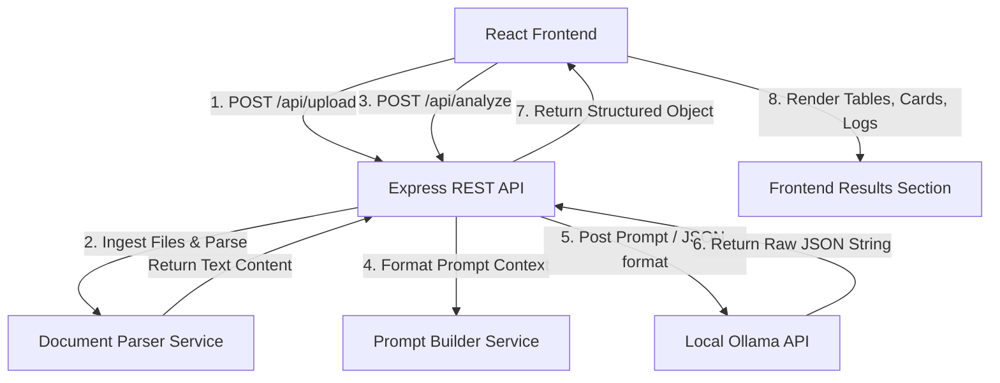
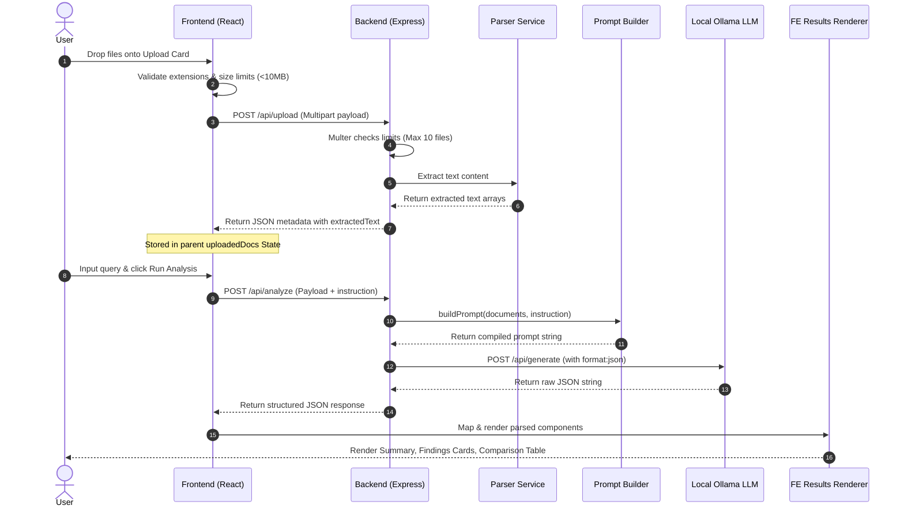

# Multi-Document Intelligence Workbench

Multi-Document Intelligence Workbench is a full-stack, local-first AI application designed to aggregate, parse, compare, and extract structured insights from multiple files simultaneously. Users can upload multiple documents (PDF and TXT), provide custom analysis queries (or select from a list of predefined presets), and receive structured, citation-aware AI-powered insights.

The platform is designed to be **privacy-first**, utilizing a local **Ollama** model runner instead of cloud-based APIs, ensuring that all document parsing, text extraction, and model inference remain entirely on the local machine.

---

## Table of Contents
1. [Project Overview](#project-overview)
2. [Features](#features)
3. [Tech Stack](#tech-stack)
4. [Architecture](#architecture)
5. [Project Structure](#project-structure)
6. [Application Workflow](#application-workflow)
7. [API Endpoints](#api-endpoints)
8. [AI Pipeline](#ai-pipeline)
9. [Prompt Engineering](#prompt-engineering)
10. [Security Considerations](#security-considerations)
11. [Assumptions](#assumptions)
12. [Known Limitations](#known-limitations)
13. [Production Improvements](#production-improvements)
14. [Local Development](#local-development)
15. [Environment Variables](#environment-variables)
16. [Screenshots](#screenshots)
17. [Testing](#testing)
18. [License](#license)

---

## Project Overview

The **Multi-Document Intelligence Workbench** acts as an analytical workspace where you can upload documents and execute cross-document queries.

- **Upload**: Drop up to 10 files (PDF or TXT, up to 10MB each) into the staging area.
- **Instruct**: Enter custom queries such as comparing contract start dates, listing key stakeholders, or searching for inconsistencies.
- **Understand**: The system extracts the text contents, formats a custom prompt preserving document boundaries, and streams it to **Ollama** running locally.
- **Response**: The local LLM processes the documents and returns a structured JSON payload which is compiled into summary cards, key findings, comparisons tables, missing data warnings, and file references.

---

## Features

- **Ingestion & Processing**:
  - Drag-and-drop file uploader supporting Multi-file uploads.
  - Support for **PDF (`.pdf`)** and **Plain Text (`.txt`)** formats.
  - Parallel asynchronous text extraction using `pdf-parse` (binary buffer parsing) and Node `fs/promises`.
  - Client-side size & extension pre-validation.

- **AI Analysis**:
  - Presets panel for quick-selection analysis prompts (e.g. *Compare all uploaded documents*, *Find inconsistencies*, *Summarize documents*).
  - Integration with **Ollama** running locally (defaulting to `qwen2.5:7b`).
  - Structured JSON schema enforcement via Ollama's native output parsing configuration.
  - Fail-safe network timeout controls (120-second threshold) and connection checking alerts.

- **Workbench UI**:
  - Dark-mode, glassmorphism theme using Tailwind CSS.
  - Card-based file staging view containing name, size, type, and item deletion controls.
  - Interactive workspace panel listing the active knowledge base.
  - Dynamic result renderer featuring overall summary, key findings list, missing information logs, and source file citations.
  - **Auto-split Comparison Table**: Dynamically parses list items containing `|` delimiters into structured, color-coded rows (`Field | Document A | Document B | Status`).
  - **Clipboard Copy Utility**: Copies the complete markdown analysis format to clipboard with single-click feedback triggers.

---

## Tech Stack

### Frontend
- **React 19**: Modern component lifecycle, hooks, and clean state propagation.
- **Vite**: Rapid asset compilation, hot module reloading, and bundler packaging.
- **Tailwind CSS**: Utility-first styling with customized colors tailored for the workbench.
- **Axios**: HTTP client requesting APIs with configured endpoints.
- **React Router (v7)**: Routing handler.

### Backend
- **Node.js & Express**: Extensible typescript HTTP REST server.
- **TypeScript**: Shared type-safety compile-time declarations across frontend and backend.
- **Multer**: Multi-part form-data / file upload handling middleware.
- **Helmet**: Set secure HTTP response header values.
- **CORS**: Handles cross-origin requests.
- **Morgan**: Detailed Express request console logger.

### Database
- **Prisma ORM & SQLite**: Lightweight, file-based relational storage (configured and migration-ready).

### Document Processing
- **pdf-parse**: Extracts plain text from binary PDF data streams.
- **fs/promises**: Reads plain text contents from `.txt` documents.

### AI Model
- **Ollama**: Local model execution runner.
- **Model**: `qwen2.5:7b` (default, supports native JSON formatting constraints).

---

## Architecture

The workspace is organized as an npm workspaces monorepo separating client UI logic and Express REST servers.

### Conceptual Flow Chart

```
+--------------------------------------------------------------------+
|                           React Client                             |
|          (UploadSection, PromptSection, ResultsSection)            |
+--------------------------------------------------------------------+
                                   |
                         (Axios HTTP Requests)
                                   v
+--------------------------------------------------------------------+
|                         Express API Gateway                        |
|             (app.ts, Router Registry, CORS, Helmet)                |
+--------------------------------------------------------------------+
           /                                              \
          / (Ingest Multi-part)                            \ (Context Analysis)
         v                                                  v
+-----------------------+                         +------------------+
|   Multer Ingestor &   |                         |  Prompt Builder  |
|   Document Parsers    |                         |     Service      |
|  (pdf-parse / fs)     |                         | (Boundaries, JSON|
+-----------------------+                         |  output format)  |
                                                  +------------------+
                                                            |
                                                   (Axios HTTP Client)
                                                            v
                                                  +------------------+
                                                  |   Local Ollama   |
                                                  |     Service      |
                                                  | (qwen2.5:7b model|
                                                  +------------------+
```

### System Architecture Diagram



---

## Project Structure

```
multi-document-intelligence-workbench/
├── backend/
│   ├── prisma/
│   │   └── schema.prisma         # SQLite database datasource url schema
│   ├── src/
│   │   ├── app.ts                # Express application configs, headers & middleware
│   │   ├── server.ts             # Listening entrypoint server binding (Port 5001)
│   │   ├── controllers/
│   │   │   ├── health.controller.ts  # Health check handler
│   │   │   └── upload.controller.ts  # Upload orchestrator mapping parsing requests
│   │   ├── routes/
│   │   │   ├── index.ts          # Core router mounting
│   │   │   ├── health.route.ts   # GET /health registry
│   │   │   ├── upload.routes.ts  # POST /upload registry
│   │   │   └── analyze.routes.ts # POST /analyze registry
│   │   ├── services/
│   │   │   ├── parser.service.ts # pdf-parse / fs extraction routing
│   │   │   ├── prompt.service.ts # Context prompt string builder
│   │   │   └── ai.service.ts     # Local Ollama Axios client integration
│   │   ├── middleware/
│   │   │   ├── error.middleware.ts  # Graceful HTTP error logging
│   │   │   └── upload.middleware.ts # Multer files limit validation
│   │   └── uploads/              # Physical disk staging directory for files
│   ├── .env                      # Local server configuration parameters
│   └── tsconfig.json             # CommonJS TypeScript compilation rules
├── frontend/
│   ├── src/
│   │   ├── components/
│   │   │   ├── UploadSection.tsx  # Drag-and-Drop uploader staged files list
│   │   │   ├── PromptSection.tsx  # Analysis instruction textarea and preset pills
│   │   │   └── ResultsSection.tsx # Insights renderer and dynamic table resolver
│   │   ├── pages/
│   │   │   └── Home.tsx          # Orchestrator dashboard holding states and callbacks
│   │   ├── layouts/
│   │   │   └── Layout.tsx        # Responsive screen layout wrapper
│   │   ├── services/
│   │   │   └── api.ts            # Axios client instance (proxies to Port 5001)
│   │   ├── App.tsx               # Main routing controller
│   │   ├── index.css             # Tailwind rules and styling classes
│   │   └── main.tsx              # DOM root mount
│   ├── vite.config.ts            # Dev server and API proxy configurations
│   └── tailwind.config.js        # Theme additions
├── package.json                  # Monorepo workspaces definition
└── README.md                     # This documentation file
```

---

## Application Workflow



---

## API Endpoints

### 1. Health Check
Checks if the backend API service is running.
- **Method**: `GET`
- **Path**: `/api/health`
- **Request Body**: None
- **Response**: `200 OK`
  ```json
  {
    "success": true,
    "message": "Server running"
  }
  ```

### 2. Document Upload & Extraction
Uploads documents (max 10, limit 10MB each, PDF or TXT only), parses their text contents, and returns metadata.
- **Method**: `POST`
- **Path**: `/api/upload`
- **Request Headers**: `Content-Type: multipart/form-data`
- **Request Body**: Form fields `files` (array of file buffers).
- **Response**: `200 OK`
  ```json
  {
    "success": true,
    "documents": [
      {
        "id": "fe40e002-68f1-4568-bcf2-2cd7dc492f17",
        "fileName": "resume.pdf",
        "fileType": "application/pdf",
        "extractedText": "Jane Doe. Software Architect..."
      }
    ]
  }
  ```
- **Error Responses**:
  - `400 Bad Request` (Unsupported file type or file size limit exceeded).
  ```json
  {
    "success": false,
    "message": "Unsupported file type. Only PDF (.pdf) and TXT (.txt) files are allowed."
  }
  ```

### 3. AI Document Analysis
Queries the local Ollama LLM with custom queries and document context, returning structured JSON results.
- **Method**: `POST`
- **Path**: `/api/analyze`
- **Request Headers**: `Content-Type: application/json`
- **Request Body**:
  ```json
  {
    "documents": [
      {
        "fileName": "resume.pdf",
        "fileType": "application/pdf",
        "extractedText": "Jane Doe. Software Architect..."
      }
    ],
    "instruction": "Compare document experience values."
  }
  ```
- **Response**: `200 OK` (Raw AI JSON response)
  ```json
  {
    "summary": "The document contains the resume details of Jane Doe.",
    "findings": [
      {
        "finding": "Jane has 5 years of TypeScript experience",
        "source": ["resume.pdf"]
      }
    ],
    "comparison": [
      "Field | resume.pdf | vacancy.txt | Status",
      "Languages | TypeScript, Node | TypeScript | Match"
    ],
    "missingInformation": [
      {
        "info": "No salary expectations are listed."
      }
    ],
    "sources": [
      {
        "name": "resume.pdf"
      }
    ]
  }
  ```
- **Error Responses**:
  - `400 Bad Request` (Missing payload components / validation errors).
  - `503 Service Unavailable` (Ollama offline / model not loaded).
  ```json
  {
    "success": false,
    "message": "Ollama service is unavailable at http://localhost:11434. Please ensure Ollama is running locally and the model 'qwen2.5:7b' is pulled."
  }
  ```

---

## AI Pipeline

The application processes inputs in a sequential, structured pipeline:

1. **Document Upload**: Multi-file payload arrives at the backend.
2. **File Validation**: Multer checks file count (max 10), mime-types (PDF or TXT only), and size limits (<10MB each).
3. **Text Extraction**: The parser router delegates TXT to filesystem text readers and PDF to buffer parse streams.
4. **Prompt Generation**: The system formats instructions, filenames, document type categories, and rules inside discrete segment boundaries.
5. **Ollama Integration**: Axios submits a POST request to `${OLLAMA_BASE_URL}/api/generate` with `"format": "json"` to enforce structured JSON output.
6. **Structured Response**: The backend parses the LLM's response string and returns it directly to the client.
7. **Result Rendering**: The React app reads the properties, renders summary widgets, populates findings cards, parses comparison table rows, maps gaps, and highlights sources.

---

## Prompt Engineering

The system uses a highly structured prompt configuration to optimize local LLM responses:

- **System Context Integration**: Declares the AI as a professional document analyst tasked with parsing strict file structures.
- **Document Boundary Separation**: Formats each document with clear separators, including filename and file type headers.
- **Zero Hallucination Constraints**: Instructs the model to answer *only* using information found in the uploaded documents and clearly call out gaps.
- **Citation Anchoring**: Requires every finding to explicitly reference its source document.
- **Output JSON Enforcement**: Requests raw JSON output without backticks, matching a specific schema key layout.
- **Table Formatting**: Instructs the LLM to format comparison items using the `|` delimiter (`Field | Doc A | Doc B | Status`) so that they can be dynamically split and rendered as a table on the frontend.

---

## Security Considerations

- **File Extensions & Mime-Types**: Strict whitelist validation blocks non-PDF/non-TXT uploads, mitigating remote execution risks.
- **Size & Count Safeguards**: Hard caps (10MB per file, max 10 files) protect the server from disk or memory exhaustion.
- **File System Namespacing**: UUIDs replace user-provided filenames on the server disk, preventing directory traversal attacks.
- **Input Sanitization**: Request bodies undergo strict type checks before processing.
- **Local AI Execution**: All document data is processed locally. No external APIs or cloud LLMs are queried, preventing data leakage.
- **Security Headers**: Express mounts Morgan logs and Helmet security headers, blocking clickjacking and cross-origin leakage.

---

## Assumptions

- **Local Infrastructure**: It is assumed the host machine has **Ollama** installed and running on `http://localhost:11434` with the `qwen2.5:7b` model pulled.
- **Document Readability**: Extracted texts are assumed to be plain ASCII/UTF-8. Highly stylized layouts or scanned images without OCR may yield limited extraction results.
- **Comparison Table Structure**: It is assumed that comparison aspect rows generated by the local LLM follow the standard `|` delimiter format for tabular rendering.

---

## Known Limitations

- **OCR Support**: Scanned PDFs (images) will yield empty extractions as the system does not run local Optical Character Recognition (OCR) libraries.
- **Token Limits**: Large documents (e.g. >100 pages) may exceed the default context window length of the local Ollama runner, resulting in truncated context or incomplete analysis.
- **Local CPU/GPU Limits**: Local LLM inference performance depends heavily on the host machine's hardware (e.g. Apple Silicon Unified Memory or dedicated NVIDIA GPUs).

---

## Production Improvements

To run this application in a production environment, consider the following enhancements:

- **Database Migration**: Move from SQLite to a production-grade database like **PostgreSQL** to handle concurrent operations.
- **Caching Layer**: Implement **Redis** to cache extracted document text and analysis responses, reducing redundant LLM calls.
- **Dockerization**: Containerize the React app, Express server, and database using **Docker Compose** for consistent deployment.
- **Asynchronous Task Queue**: Offload document parsing and LLM inference to background workers using a library like **BullMQ** to prevent request timeouts.
- **Optical Character Recognition (OCR)**: Integrate a local library like **Tesseract.js** or a cloud service to extract text from scanned PDFs.
- **Vector Database & RAG**: Implement chunking and a vector database (e.g., **pgvector**, **Chroma**) to retrieve relevant document context (Retrieval-Augmented Generation) for very large files.
- **Streaming Responses**: Refactor the backend and frontend to stream LLM responses token-by-token for a more responsive user experience.
- **Authentication**: Add user authentication and workspace isolation (e.g., **Auth0**, **JWT**) to secure user data.
- **Logging & Monitoring**: Add production logging (e.g., **Winston**, **Pino**) and monitoring tools (e.g., **Prometheus**, **Grafana**) to track system performance.

---

## Local Development

### 1. Prerequisites
- **Node.js**: `v20.x` or newer (Recommended: `v25.x`)
- **npm**: `v10.x` or newer
- **Ollama**: Installed and running locally.

### 2. Ollama Setup
Start Ollama and pull the default model:
```bash
# Pull the default model
ollama pull qwen2.5:7b
```

### 3. Installation
From the project root:
```bash
# Install workspace dependencies
npm install
```

### 4. Database Setup
Initialize the database in the backend workspace:
```bash
cd backend
npx prisma db push
```

### 5. Running the Application

#### Option A: Start both concurrently (Root script)
```bash
# Start backend (Port 5001) and frontend (Port 5173) concurrently
npm run dev
```

#### Option B: Start individually
- **Backend**:
  ```bash
  cd backend
  npm run dev
  ```
- **Frontend**:
  ```bash
  cd frontend
  npm run dev
  ```

---

## Environment Variables

Define the following environment variables in `backend/.env` (based on [`backend/.env.example`](file:///Users/rahuljaggi/Documents/GithubProjects/multi-document-intelligence-workbench/backend/.env.example)):

| Variable Name | Default Value | Description |
|---|---|---|
| `PORT` | `5001` | The port the backend Express server binds to. |
| `DATABASE_URL` | `"file:./dev.db"` | Connection string for SQLite. |
| `OLLAMA_BASE_URL` | `"http://localhost:11434"` | API endpoint for the local Ollama instance. |
| `OLLAMA_MODEL` | `"qwen2.5:7b"` | Model loaded for document analysis. |

---

## Screenshots

| Application Home | Upload Documents | Analysis Results |
| :---: | :---: | :---: |
|  |  |  |

---

## Testing

### Running API Health Checks
You can verify the backend is running by executing:
```bash
curl -i http://localhost:5001/api/health
```

### Verification Builds
To verify TypeScript compilation and build correctness across workspaces:
```bash
# Build backend
npm run build -w backend

# Build frontend
npm run build -w frontend
```

---

## License

This project is licensed under the [MIT License](LICENSE).
